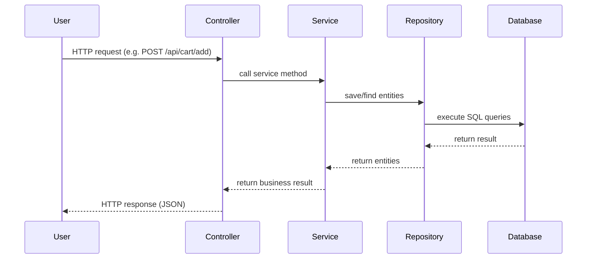

# Simple Car Rental Backend

This project is a **minimal car rental backend** built with Spring Boot 3 and Java 17.  It demonstrates a layered architecture—presentation, business, persistence and database layers—as recommended by Spring Boot【57486733075438†L102-L166】.  The backend exposes REST endpoints secured with HTTP Basic authentication, uses JPA/Hibernate for database access and renders a simple HTML page showing available cars.

## 1. Project setup

### Dependencies and build

The Maven [`pom.xml`](pom.xml) declares a set of Spring Boot “starters” that pull in everything you need:

* **spring‑boot‑starter‑web** – embeds a Tomcat server and Spring MVC.
* **spring‑boot‑starter‑data‑jpa** – provides JPA and Hibernate integration.
* **spring‑boot‑starter‑thymeleaf** – enables Thymeleaf templates for the home page.
* **spring‑boot‑starter‑security** – adds authentication and authorization support.
* **H2 database** – an in‑memory database used for development and testing.

Spring Boot’s parent POM manages dependency versions.  The project targets **Java 17**.

### Configuration

Important settings live in `src/main/resources/application.properties`:

* **In‑memory database** – the application uses H2 at `jdbc:h2:mem:carrentaldb`.  Hibernate generates tables from JPA entities and updates the schema automatically.
* **H2 console** – enabled at `/h2-console` to inspect the database.
* **Thymeleaf** – caching is disabled so template changes reload automatically.
* **SQL logging** – SQL statements and bind parameters are printed for learning.

### Running the application

Ensure Java 17 and Maven are installed.  From the `carrental` directory run:

```bash
mvn spring-boot:run
```

Maven will download dependencies, build the project and launch an embedded server on port 8080.  Visit `http://localhost:8080` to see the home page listing sample cars.  The REST API is secured with HTTP Basic authentication—use username `user` and password `password`.

## 2. API endpoints and sample commands

All `/api` endpoints require authentication.  Use `-u user:password` with cURL.

| HTTP Method & Path | Description | Sample cURL |
|---|---|---|
| `GET /api/cars` | List all available cars. | `curl -u user:password http://localhost:8080/api/cars` |
| `GET /api/cars/{id}` | Get details of a single car. | `curl -u user:password http://localhost:8080/api/cars/1` |
| `GET /api/cart` | View the authenticated user’s cart. | `curl -u user:password http://localhost:8080/api/cart` |
| `POST /api/cart/add?carId=1&days=3` | Add car 1 to the cart for 3 days. | `curl -u user:password -X POST 'http://localhost:8080/api/cart/add?carId=1&days=3'` |
| `POST /api/cart/checkout` | Convert the cart into a booking and clear it. | `curl -u user:password -X POST http://localhost:8080/api/cart/checkout` |
| `GET /api/bookings` | List all bookings made by the authenticated user. | `curl -u user:password http://localhost:8080/api/bookings` |

To explore the database, open `http://localhost:8080/h2-console` and connect to `jdbc:h2:mem:carrentaldb`.

## 3. Data flow and layered architecture

Spring Boot follows a **layered architecture**: presentation (controllers), business (services), persistence (repositories) and database【57486733075438†L102-L166】.  The flow works as follows:

1. **Presentation layer** – handles HTTP requests through `@RestController` and `@Controller` classes.  Controllers parse request parameters, perform validation and forward calls to services【57486733075438†L117-L122】.
2. **Business layer** – implemented by `@Service` classes.  Services contain application logic, enforce rules and coordinate calls to repositories【57486733075438†L124-L134】.
3. **Persistence layer** – uses Spring Data JPA `@Repository` interfaces to communicate with the database.  Extending `JpaRepository` automatically provides CRUD methods without writing implementations【10272057831146†L227-L241】.
4. **Database layer** – H2 stores data in memory.  Hibernate translates entity operations into SQL.

Requests flow from the user to controllers, then to services, on to repositories and finally to the database【57486733075438†L160-L166】.  The response moves back up the stack.

## 4. Technical explanation

### Layered components

* **Entities** – represent domain objects such as `Car`, `Cart` and `Booking`.  Classes annotated with `@Entity` map to database tables.  The primary key is annotated with `@Id`, and `@GeneratedValue` instructs JPA to generate the key automatically【10272057831146†L190-L197】.

* **Repositories** – encapsulate data access.  By extending `JpaRepository`, a repository inherits methods for saving, deleting and querying entities, and Spring generates the implementation at runtime【10272057831146†L227-L241】.

* **Services** – hold business logic.  They validate input, compute totals and coordinate multiple repositories.  In this project services handle operations like `addCarToCart` and `checkout`【57486733075438†L124-L134】.

* **Controllers** – expose functionality over HTTP.  `@RestController` methods return JSON, while `@Controller` methods return view names for Thymeleaf templates【57486733075438†L117-L122】.

* **`@SpringBootApplication`** – convenience annotation combining configuration, component scanning and auto‑configuration【10272057831146†L265-L278】.

### Basic Auth in Spring Security

HTTP Basic authentication uses the `WWW‑Authenticate` header to challenge unauthenticated clients【989664656723541†L272-L276】.  The client resends the request with an `Authorization` header containing a Base64‑encoded username and password.  Spring Security’s `BasicAuthenticationFilter` extracts the credentials, wraps them in a `UsernamePasswordAuthenticationToken` and hands them to the authentication manager for verification【989664656723541†L283-L289】.  Upon success, the user is stored in the security context; otherwise a 401 response is returned.  In this project a single in‑memory user (`user`/`password`) is defined for demonstration.

### Booking flow (Cart → Booking)

1. **Add a car to the cart** – `POST /api/cart/add?carId=…&days=…` calls `CartService.addCarToCart`, which loads or creates a cart for the user and adds the car with the specified rental days.
2. **View the cart** – `GET /api/cart` returns all `CartItem` entries.  Each item stores the car and the number of rental days.  A helper method on the `Cart` entity computes the subtotal.
3. **Checkout** – `POST /api/cart/checkout` invokes `BookingService.checkout`.  It verifies that the cart is not empty, creates a new `Booking`, converts each `CartItem` into a `BookingItem` (copying the daily rate and days) and calculates the total cost.  The booking is saved to the database and the cart is cleared.

## 5. Request flow diagram



## 6. Summary

This starter project demonstrates how to implement a basic car rental backend with Spring Boot.  It uses a layered architecture to separate concerns, JPA for persistence and Spring Security for authentication.  The code contains inline comments explaining each component, and the accompanying documentation includes sample commands and a flow diagram to help you understand how requests are processed through the system.【57486733075438†L87-L109】【10272057831146†L227-L241】